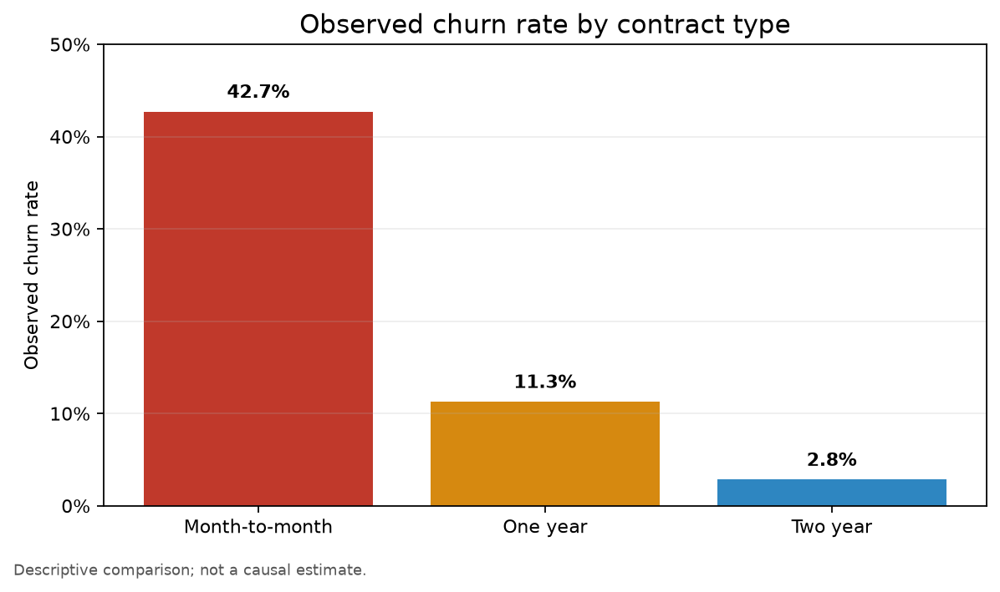

# Telecom Customer Retention & Churn Analytics

A Python-based telecom analytics project examining customer churn across contract type, tenure, service attributes, payment method, customer characteristics, and billing fields. The project converts a customer-level extract into retention-oriented questions while keeping the conclusions descriptive and non-causal.

## Business Problem

Telecom retention teams need to identify customer segments with higher observed churn and understand where early engagement or service follow-up may be useful. This project compares churn across contract structures and customer attributes, documents the preparation of `TotalCharges`, and provides a reproducible basis for prioritising further retention analysis.

The dataset is an anonymized analytical extract rather than a live customer system. The observed differences describe associations in the supplied records; they do not prove that contract type, payment method, tenure, or any other feature causes churn.

## Business Objectives

The project is designed to:

- Measure the overall scale of observed customer churn.
- Compare churn rates across contract types and customer characteristics.
- Examine tenure as an indicator of where retention attention may be most relevant.
- Profile service and payment dimensions that can support follow-up segmentation.
- Document data-quality handling and identifier checks for reproducibility.
- Translate descriptive patterns into testable retention questions rather than unsupported causal recommendations.

## Decision-Oriented Business Questions

1. Which contract groups have the highest and lowest observed churn rates?
2. Is churn concentrated among newer customers, and how should early-tenure engagement be investigated?
3. How do observed churn rates differ by payment method and internet-service type?
4. How does churn vary between senior-citizen and non-senior-citizen records?
5. What customer or service dimensions should be combined with contract type before prioritising retention outreach?
6. Which data and experiment gaps must be addressed before a retention intervention is evaluated?

## Verified Dataset Profile

The repository includes the customer-level CSV used by the notebook and validation workflow. The values below are calculated from the current file.

| Metric | Verified result |
| --- | ---: |
| Customer records | 7,043 |
| Analytical columns | 21 |
| Churned customers | 1,869 |
| Overall observed churn rate | 26.54% |
| Duplicate customer IDs | 0 |
| Negative or invalid churn labels | None detected by validation |

### Dataset fields

The extract contains customer identifiers, demographic attributes, tenure, phone and internet-service attributes, support and streaming services, contract and billing dimensions, monthly and total charges, and the `Churn` target. The full column set is visible in `Customer.csv` and the notebook’s schema output.

| Dimension or measure | Representative fields |
| --- | --- |
| Customer and demographics | `customerID`, `gender`, `SeniorCitizen`, `Partner`, `Dependents` |
| Tenure and services | `tenure`, `PhoneService`, `MultipleLines`, `InternetService`, `OnlineSecurity`, `OnlineBackup`, `DeviceProtection`, `TechSupport`, `StreamingTV`, `StreamingMovies` |
| Commercial relationship | `Contract`, `PaperlessBilling`, `PaymentMethod` |
| Billing measures | `MonthlyCharges`, `TotalCharges` |
| Outcome | `Churn` |

## Data Preparation

The notebook and validation workflow apply a focused preparation process:

1. Load the customer extract into Pandas.
2. Inspect schema, data types, null counts, descriptive statistics, and customer identifiers.
3. Replace blank `TotalCharges` values with `0`, consistent with the notebook’s stated interpretation of zero-tenure records without recorded total charges.
4. Convert `TotalCharges` from text to numeric values.
5. Confirm that the prepared dataframe has no remaining null values, that customer IDs are unique, and that churn labels are limited to `Yes` and `No`.
6. Recode `SeniorCitizen` from `0/1` to readable labels in the notebook’s exploratory section.
7. Compare churn through grouped summaries and charts for overall churn, gender, senior-citizen status, tenure, and contract type.

The public workflow does not claim imputation beyond the explicit `TotalCharges` blank handling, duplicate removal, outlier treatment, or causal feature engineering. Those decisions should be revisited if the source system or data dictionary provides additional context.

## KPI Framework

The project uses observed churn and customer-volume measures rather than profitability or lifetime-value KPIs.

| KPI | Definition | Business meaning |
| --- | --- | --- |
| **Customer Count** | Number of customer records in the extract. | Size of the observed customer base. |
| **Churned Customers** | Count of records where `Churn = Yes`. | Number of customers marked as churned in the extract. |
| **Observed Churn Rate** | Churned customers divided by customer records. | Overall share of records marked as churned. |
| **Segment Churn Rate** | Churned records within a segment divided by all records in that segment. | Descriptive comparison of churn across contracts, services, payment methods, or customer groups. |
| **Monthly Charges** | Recorded monthly charge per customer. | Billing-level context for segment comparison; not a profit measure. |
| **Total Charges** | Recorded cumulative charge after blank-to-zero handling and numeric conversion. | Historical charge context for the available customer records. |
| **Tenure** | Recorded customer tenure, expressed in the source’s tenure unit. | Customer relationship-duration context for churn comparisons. |

## Analytical Methodology

> **CSV ingestion → schema and quality inspection → `TotalCharges` preparation → identifier and target validation → readable category recoding → segment churn comparisons → retention interpretation**

The notebook’s primary exploratory story moves from overall churn to gender and senior-citizen comparisons, tenure distribution, and contract-level churn. The reproducibility workflow validates the source file but does not execute the notebook or regenerate the chart automatically.

## Key Findings from the Current Extract

The following findings are traceable to the supplied CSV and the repository’s profiling logic.

- The extract contains **1,869 churned customers out of 7,043**, producing an overall observed churn rate of **26.54%**.
- **Month-to-month** customers have the highest observed churn rate at **42.71%**. The rate is **11.27%** for one-year contracts and **2.83%** for two-year contracts.
- **Electronic-check** customers have the highest observed churn rate among the payment-method groups at **45.29%**. Credit-card customers are at **15.24%**, bank-transfer customers at **16.71%**, and mailed-check customers at **19.11%**.
- **Fiber-optic** customers have an observed churn rate of **41.89%**, compared with **18.96%** for DSL and **7.40%** for customers with no internet service.
- Senior-citizen records show an observed churn rate of **41.68%**, compared with **23.61%** for non-senior-citizen records.

These are segment comparisons, not causal estimates. The differences may reflect tenure, service mix, pricing, customer experience, acquisition channel, or other variables that are not isolated in this descriptive analysis.

## Business Recommendations

The current evidence supports prioritising **month-to-month customers** for a retention diagnostic because this segment has the highest observed churn rate. The first-year customer journey should also receive attention because the notebook uses tenure as a core exploratory dimension; the exact intervention should be tested rather than assumed. Electronic-check and fiber-optic segments are reasonable candidates for service, billing, and experience investigation, but the analysis does not establish whether the payment method or service type is the underlying cause. Any outreach or contract-transition offer should be evaluated with a defined control group and monitored for retention, customer experience, and financial effects.

Before operational deployment, the team should add margin, discount, acquisition cost, service-quality, complaint, contact-history, and longitudinal outcome data. Those variables would help distinguish a useful retention opportunity from a correlation caused by customer mix or pricing structure.

## Visualization Presentation

The repository includes a renamed contract chart that makes the measure and its descriptive status explicit.



**Figure 1. Observed churn rate by contract type.** The chart highlights the segment difference in the supplied extract and explicitly states that it is not a causal estimate. The visual is stored under `images/` and is not duplicated at the repository root.

The notebook also contains exploratory views for overall churn, gender, senior-citizen status, tenure, and contract type. The supporting PDF was removed from the public project because it contained chat-transcript artifacts, a misspelled filename, and additional percentage claims that were not consistently traceable to the notebook workflow.

## Limitations

- The data is an anonymized analytical extract and should not be treated as a live retention system.
- The dataset documentation does not provide a full business data dictionary or source-system refresh context.
- Replacing blank `TotalCharges` with zero is an explicit modeling assumption for the available records and should be validated with the source owner.
- The project is descriptive and does not establish causal effects.
- Contract, payment, internet service, tenure, and senior-citizen differences may be confounded by one another and by unobserved customer-experience factors.
- No experiment, treatment-control design, survival model, or production churn-prediction model is implemented.
- Revenue, margin, cost-to-serve, acquisition cost, and retention-program economics are not available as decision KPIs.
- The automated workflow validates the dataset but does not run the notebook end to end.

## Reproducibility

### Requirements

- Python 3.11 or a compatible Python 3 release.
- The dependencies listed in `requirements.txt`.
- Jupyter for interactive notebook execution.

### Setup and validation

```bash
git clone https://github.com/Corvus06655/telecom-customer-retention-analytics.git
cd telecom-customer-retention-analytics
python -m venv .venv
# Windows: .venv\Scripts\activate
# macOS/Linux: source .venv/bin/activate
pip install -r requirements.txt
python scripts/validate_data.py
python scripts/profile_data.py
```

Then open `telecom_customer_churn_analysis.ipynb` in Jupyter and run the cells from top to bottom. The validation script should confirm the documented customer count, unique IDs, churn labels, and churn count. The profiling utility prints the observed segment rates used in this README.

## Repository Structure

```text
├── .github/
│   └── workflows/
│       └── validate.yml
├── Customer.csv
├── telecom_customer_churn_analysis.ipynb
├── images/
│   └── churn-rate-by-contract.png
├── requirements.txt
├── scripts/
│   ├── profile_data.py
│   └── validate_data.py
└── README.md
```

The repository keeps the source extract, notebook, validation workflow, profiling utility, and decision-facing chart together. Duplicate image exports and the stale narrative PDF are not retained.

## Professional Positioning

This project does not claim unique data or a production churn model. Its portfolio value comes from framing churn as a retention decision problem, separating observed segment differences from causal claims, documenting the `TotalCharges` preparation assumption, validating identifiers and target labels, and showing how additional operational data would be needed before intervention decisions are made.

## References

[1]: Customer.csv "Customer-level telecom churn extract used by the project"
[2]: telecom_customer_churn_analysis.ipynb "Notebook containing the data preparation and exploratory analysis workflow"
[3]: scripts/validate_data.py "Automated dataset validation checks"
[4]: scripts/profile_data.py "Reproducible segment-rate profiling utility"
[5]: images/churn-rate-by-contract.png "Observed churn rate by contract type"
